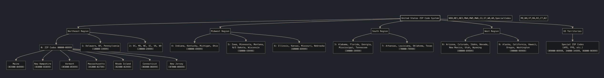
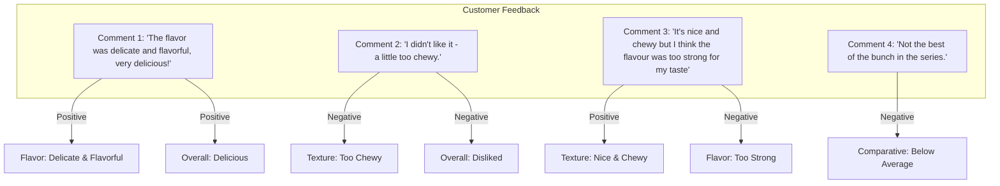
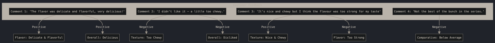

# Learning [mermaid JS](https://github.com/mermaid-js/mermaid)

Just one of the things I'm learning. <https://github.com/hchiam/learning>

Generate diagrams from markdown-like code. <https://github.com/mermaid-js/mermaid>

Andrej Karpathy video that showed mermaidJS being generated in Claude Artifacts (just one of the topics in this video): <https://www.youtube.com/watch?v=EWvNQjAaOHw>

prompt --> mermaid code --> diagram

Me playing around with learning mermaid in Claude with Artifacts automatically generated:

- US zip code patterns: <https://claude.ai/share/f2c74fe0-28d5-4154-85eb-86453915c2a2>
- flavor comment feedback analysis: <https://claude.ai/share/a54c1d50-e8f9-4e5a-b1ec-d999dd3c10a3>

Example mermaid output:

```mermaid
flowchart TD
    USA["United States ZIP Code System"]
    
    USA --> Northeast["Northeast Region"]
    USA --> Midwest["Midwest Region"]
    USA --> South["South Region"]
    USA --> West["West Region"]
    USA --> Territories["US Territories"]
    
    Northeast --> NE0["0: ZIP Codes 00000-08999"]
    NE0 --> ME["Maine\n(03900-04999)"]
    NE0 --> NH["New Hampshire\n(03000-03899)"]
    NE0 --> VT["Vermont\n(05000-05999)"]
    NE0 --> MA["Massachusetts\n(01000-02799)"]
    NE0 --> RI["Rhode Island\n(02800-02999)"]
    NE0 --> CT["Connecticut\n(06000-06999)"]
    NE0 --> NJ["New Jersey\n(07000-08999)"]
    Northeast --> NE1["1: Delaware, NY, Pennsylvania\n(10000-19999)"]
    Northeast --> NE2["2: DC, MD, NC, SC, VA, WV\n(20000-29999)"]
    
    Midwest --> MW4["4: Indiana, Kentucky, Michigan, Ohio\n(40000-49999)"]
    Midwest --> MW5["5: Iowa, Minnesota, Montana,\nN/S Dakota, Wisconsin\n(50000-59999)"]
    Midwest --> MW6["6: Illinois, Kansas, Missouri, Nebraska\n(60000-69999)"]
    
    South --> S3["3: Alabama, Florida, Georgia,\nMississippi, Tennessee\n(30000-39999)"]
    South --> S7["7: Arkansas, Louisiana, Oklahoma, Texas\n(70000-79999)"]
    
    West --> W8["8: Arizona, Colorado, Idaho, Nevada,\nNew Mexico, Utah, Wyoming\n(80000-89999)"]
    West --> W9["9: Alaska, California, Hawaii,\nOregon, Washington\n(90000-99999)"]
    
    Territories --> SpecialCodes["Special ZIP Codes\n(APO, FPO, etc.)\n(09000-09999, 34000-34999, 96000-96999)"]
    
    style USA fill:#f9f9f9,stroke:#333,stroke-width:2px
    style Northeast fill:#d4f1f9,stroke:#333,stroke-width:1px
    style Midwest fill:#e1f7d5,stroke:#333,stroke-width:1px
    style South fill:#ffedd1,stroke:#333,stroke-width:1px
    style West fill:#ffe6e6,stroke:#333,stroke-width:1px
    style Territories fill:#f2e6ff,stroke:#333,stroke-width:1px
    
    style NE0,NE1,NE2,MW4,MW5,MW6,S3,S7,W8,W9,SpecialCodes fill:#ffffff,stroke:#333,stroke-width:1px
style ME,NH,VT,MA,RI,CT,NJ fill:#d4f1f9,stroke:#333,stroke-width:1px
```

<details>
<summary>mermaid code for US zip code patterns</summary>



```text
flowchart TD
    USA["United States ZIP Code System"]
    
    USA --> Northeast["Northeast Region"]
    USA --> Midwest["Midwest Region"]
    USA --> South["South Region"]
    USA --> West["West Region"]
    USA --> Territories["US Territories"]
    
    Northeast --> NE0["0: ZIP Codes 00000-08999"]
    NE0 --> ME["Maine\n(03900-04999)"]
    NE0 --> NH["New Hampshire\n(03000-03899)"]
    NE0 --> VT["Vermont\n(05000-05999)"]
    NE0 --> MA["Massachusetts\n(01000-02799)"]
    NE0 --> RI["Rhode Island\n(02800-02999)"]
    NE0 --> CT["Connecticut\n(06000-06999)"]
    NE0 --> NJ["New Jersey\n(07000-08999)"]
    Northeast --> NE1["1: Delaware, NY, Pennsylvania\n(10000-19999)"]
    Northeast --> NE2["2: DC, MD, NC, SC, VA, WV\n(20000-29999)"]
    
    Midwest --> MW4["4: Indiana, Kentucky, Michigan, Ohio\n(40000-49999)"]
    Midwest --> MW5["5: Iowa, Minnesota, Montana,\nN/S Dakota, Wisconsin\n(50000-59999)"]
    Midwest --> MW6["6: Illinois, Kansas, Missouri, Nebraska\n(60000-69999)"]
    
    South --> S3["3: Alabama, Florida, Georgia,\nMississippi, Tennessee\n(30000-39999)"]
    South --> S7["7: Arkansas, Louisiana, Oklahoma, Texas\n(70000-79999)"]
    
    West --> W8["8: Arizona, Colorado, Idaho, Nevada,\nNew Mexico, Utah, Wyoming\n(80000-89999)"]
    West --> W9["9: Alaska, California, Hawaii,\nOregon, Washington\n(90000-99999)"]
    
    Territories --> SpecialCodes["Special ZIP Codes\n(APO, FPO, etc.)\n(09000-09999, 34000-34999, 96000-96999)"]
    
    style USA fill:#f9f9f9,stroke:#333,stroke-width:2px
    style Northeast fill:#d4f1f9,stroke:#333,stroke-width:1px
    style Midwest fill:#e1f7d5,stroke:#333,stroke-width:1px
    style South fill:#ffedd1,stroke:#333,stroke-width:1px
    style West fill:#ffe6e6,stroke:#333,stroke-width:1px
    style Territories fill:#f2e6ff,stroke:#333,stroke-width:1px
    
    style NE0,NE1,NE2,MW4,MW5,MW6,S3,S7,W8,W9,SpecialCodes fill:#ffffff,stroke:#333,stroke-width:1px
style ME,NH,VT,MA,RI,CT,NJ fill:#d4f1f9,stroke:#333,stroke-width:1px
```

</details>



<details>
<summary>mermaid code for flavor comment feedback analysis</summary>



```text
flowchart TD
    subgraph "Customer Feedback"
    A["Comment 1: 'The flavor was delicate and flavorful, very delicious!'"]
    B["Comment 2: 'I didn't like it - a little too chewy.'"]
    C["Comment 3: 'It's nice and chewy but I think the flavour was too strong for my taste'"]
    D["Comment 4: 'Not the best of the bunch in the series.'"]
    end
    
    A --> |Positive| E[Flavor: Delicate & Flavorful]
    A --> |Positive| F[Overall: Delicious]
    
    B --> |Negative| G[Texture: Too Chewy]
    B --> |Negative| H[Overall: Disliked]
    
    C --> |Positive| I[Texture: Nice & Chewy]
    C --> |Negative| J[Flavor: Too Strong]
    
    D --> |Negative| K[Comparative: Below Average]
```

</details>


